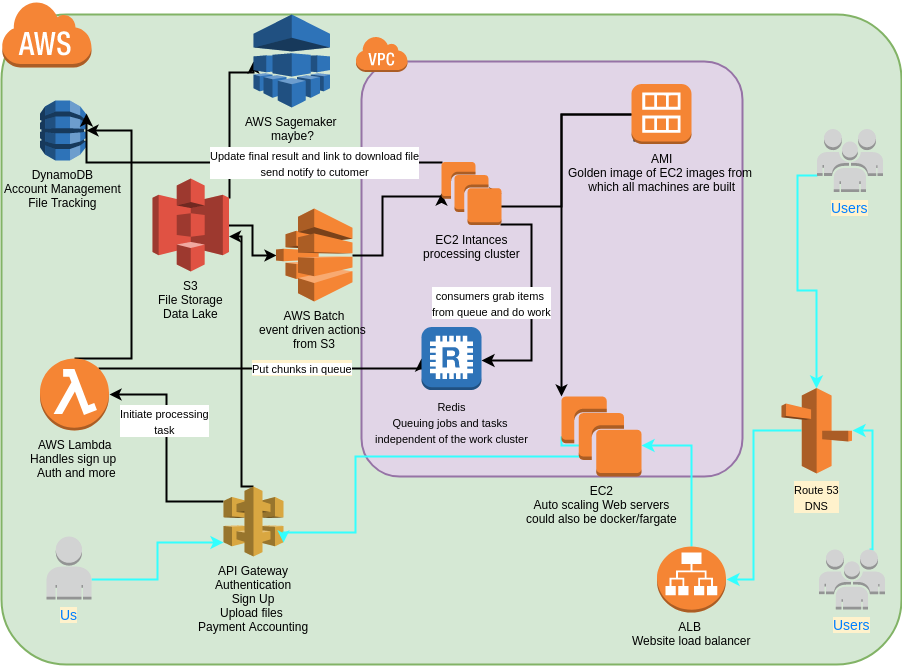

# AWS

This section attemps to organize and explain the logical and technical pieces of the AWS environment for hosting the WIP project. The project aims to facilitate users to sign up, authentication, upload files, and have them processed via out app - that hopes to incorporate some Machine Learning technologies, and report job status back to user.

Key points is that we are a very small operation ( 3 person team) with shallow pockets, so our attempts to be smart about how we are using the cloud and keep costs to an absolute minimum, is our primary focus while spinnig up this service.

## Proposed Service Map

The [.xml](wip-project-aws.xml) can be uploaded to draw.io and change/expanded as our idea of an MVP is realized and solidified.  

## Services

### API Gateway
The API gateway should act as the main point of entry for all client facing communication to the backend services. The first 33 million requests each month are essentailly Free.   

The API gateway should handle account creation, Authentication, facilitation of secure uploads, payment processing, file tracking, and job/batch creation, plus more as we expand.  

The website should use the API gateway to initiate all calls to the backend services and should essentially be a gui wrapper around the API.  

https://aws.amazon.com/api-gateway/   

### AWS Lambda  
Taking advantange of serverless architecture is key to rapidly growing and expanding while also keeping cost minimal. Other than the static website, I don't see any reason why the majority of our entire stack cannot be ran from a servless point of view, outside of speicifc requirements for gpus, static webpages, and long running processes. Lambda allows up to 1000 concurrent exections of functions in a region.  

* Sign up and Authentication  
* Access to allow user to upload to "thier" S3 bucket  
* Lambda functions to intialize batching/job creation  
* Lambda functions to drive alerts to our customers when a job is complete  
* etc  

### DynamoDB
DynamoDB will allow us to scale beyond a single region while also handling up to 40,000 reads and writes, plus being encrypted will ensure sensitive password are never leaked.   

We can store account information, file tracking, and more all in this very simple to use and administer NoSQL solution.  

https://aws.amazon.com/dynamodb/ 

### S3  
We should store all customer uploads in an S3 bucket.   

/uploads-{aws-region}/{user-id}/file.extension

The max amount of buckets per accout is 100, with the ability to request up to 1000, so that's why we should NOT make a bucket per user account.  

S3 has many features like lifecycle managment, can determine by date when a file should be deleted or moved to more cost effective storage (S3 glacier). S3 also has events capabilities so a new upload could trigger a Lambda run or other action.  

We can extend S3 to other AWS technologies like AWS Sagemaker ( AWS's managed machine learning service) and much much more. S3 might be thier most extensible and flexible service.  

https://aws.amazon.com/s3/  

### Redis / ElastiCache / SQS  
I imagine we will need a cluster of redis servers for managing queues, job tracking, file sharding, etc. AWS has a managed Redis service called ElastiCache. There is also AWS SQS which is a managed AMQP service, there are pros and cons to using either. Not locked into any one.  

https://aws.amazon.com/elasticache/  
https://aws.amazon.com/sqs/  

### AMI  
All type of EC2 servers(or docker containers): GPU servers, web server, etc, should be created from a golden image, the code release will go along with a new release of a machine, which allows for blue/green testing and keps things from drifting in production. No snowflakes allowed.

https://docs.aws.amazon.com/AWSEC2/latest/UserGuide/AMIs.html  
https://www.packer.io/  

### EC2 auto scaling groups  
Either ec2 can handle this or if we use AWS Batch it too can turn up/down machines at will. But a fiar warning that scaling with EC2 is still measured in minutes vs seconds with docker containters, so keep that in mind when optimizing our machines.

https://docs.aws.amazon.com/autoscaling/ec2/userguide/AutoScalingGroup.html  

### AWS Batch  
AWS batch seems like the best candidate for taking data in S3 and breaking the file into workable chunks, delivering those chunks to the fleet of servers, calculating how much resources are needed/scaling based on that, and reporting success/failure of jobs.  

https://aws.amazon.com/batch/  

### Route 53
Should host the domain name/zone for this service, both internal and external Zones. This will allows us to much easily generate SSL certificates, and/or leverage things like geo-location based routeing, so if we put this stack in other regions, users closest to thier region will go there.

https://aws.amazon.com/route53/  

# Input
Please let me know if we should consider any alternatives or other serives. I would like to wrap all of this infra into a set of Terraform configs so that changes to the infra are tracked and managed the same as a code release

https://www.terraform.io/ 

